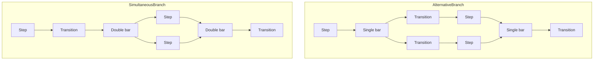
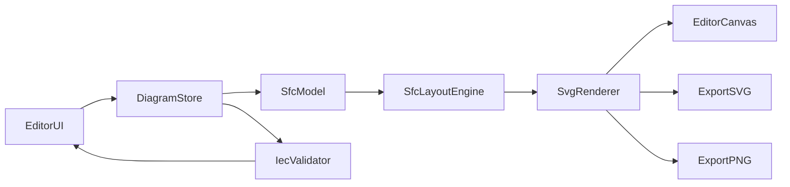

# IEC 61131-3 SFC Diagram Editor

## Goal

Create a new project at [`~/Projekte/sfc-editor`](~/Projekte/sfc-editor): a browser-based **visual editor** for drawing IEC 61131-3 Sequential Function Charts with **full standard coverage** (steps, transitions, actions, alternative/simultaneous branching, jumps) and **SVG + PNG export**.

## Why a custom SFC engine (not a generic graph library)

SFC is not a free-form node graph. IEC 61131-3 enforces strict topology and layout:

- Elements alternate: **step → transition → step → …**
- **Alternative branches** use a **single horizontal bar** and must **start and end with transitions**
- **Simultaneous (parallel) branches** use a **double horizontal bar** and must **start and end with steps**
- Actions attach horizontally to steps with **qualifiers** (`N`, `S`, `R`, `P`, `D`, `L`, `SD`, `DS`, `SL`, `P1`, `P0`)

Generic graph editors (React Flow, etc.) fight these rules. A purpose-built **SFC layout + validation engine** will produce correct diagrams and cleaner exports.



## Recommended stack

| Layer | Choice | Rationale |
|---|---|---|
| App | **React 19 + TypeScript + Vite** | Fast dev, strong typing, easy SVG in JSX |
| State | **Zustand + Immer** | Simple diagram mutations, undo/redo friendly |
| Rendering | **Native SVG** | Pixel-perfect IEC shapes; SVG export is trivial |
| Layout | **Custom recursive-region layout** | Matches PLC IDE conventions (vertical main flow, horizontal branches) |
| PNG export | **SVG → Canvas → Blob** | Same renderer for screen and export; no extra deps |
| Persistence | **JSON (`.sfc.json`)** | Human-readable, versionable, easy to extend |
| Styling | **CSS modules** | Light/dark theme without affecting export colors |

Project will be initialized with git in `~/Projekte/sfc-editor`, then opened as the workspace root before implementation.

## Architecture



### Core modules

1. **[`src/model/types.ts`](src/model/types.ts)** — canonical diagram model
   - `Step` (name, `isInitial`, actions[])
   - `Transition` (condition expression)
   - `Action` (name, qualifier, optional `TIME` interval)
   - `BranchRegion` (`alternative` | `simultaneous`, `divergence` | `convergence`, child lanes)
   - `Jump` (target label / branch mark)
   - `Connection` (directed links, typed endpoints)

2. **[`src/layout/layoutEngine.ts`](src/layout/layoutEngine.ts)** — computes x/y positions
   - Top-down main spine with fixed step/transition dimensions per IEC conventions
   - Branch lanes expand horizontally; nested branches recurse
   - Re-layout on insert/delete/reorder; optional manual nudge of branch width only (not topology-breaking free drag)

3. **[`src/render/svgRenderer.tsx`](src/render/svgRenderer.tsx)** — draws IEC shapes
   - Initial step: double-bordered rectangle
   - Step: single rectangle + name
   - Transition: horizontal bar + condition text
   - Action blocks: small rectangles to the right, formatted as `qualifier actionName(time)`
   - Branch bars: single vs double horizontal lines
   - Orthogonal connection lines with arrowheads

4. **[`src/validation/iecValidator.ts`](src/validation/iecValidator.ts)** — rule engine
   - Exactly one initial step
   - Unique step names
   - Step/transition alternation on every path
   - Branch type constraints (alt = transitions at boundaries; sim = steps at boundaries)
   - Reachability from initial step; no orphan elements
   - Action qualifier/time pairing (e.g. `L`, `D`, `SD`, `DS`, `SL` require a time interval)
   - Surface diagnostics with element IDs and human-readable messages in a problems panel

5. **[`src/editor/`](src/editor/)** — UI
   - **Toolbox**: add step, transition, action, alternative branch, simultaneous branch, jump
   - **Canvas**: click-to-select, context actions ("Insert below", "Insert branch right", "Convert to parallel/alternative")
   - **Properties panel**: edit names, conditions, qualifiers, times
   - **Toolbar**: New / Open / Save, Validate, Export SVG, Export PNG
   - **Undo/redo** for all structural edits

6. **[`src/export/`](src/export/)**
   - `exportSvg(diagram)`: serialize rendered SVG with proper `xmlns`, viewBox, optional white background
   - `exportPng(diagram)`: render SVG to offscreen canvas at 2x scale for crisp output, trigger download

## IEC 61131-3 element reference (implementation checklist)

| Element | Visual | Notes |
|---|---|---|
| Initial step | Double rectangle | Exactly one per diagram |
| Step | Rectangle | Implicit vars `IN`, `X`, `T`, `StartTime` (document in tooltips, not drawn) |
| Transition | Horizontal bar | Condition text (ST-like expression) |
| Action | Attached block | `qualifier name` or `qualifier name, T#10s` |
| Alt divergence | Single bar below step | Multiple transitions; left-to-right priority |
| Alt convergence | Single bar above step | Multiple transitions merge |
| Sim divergence | Double bar below transition | Multiple steps activate together |
| Sim convergence | Double bar above transition | All preceding steps must be active |
| Jump | Label + connector | Jump to branch mark |

Action qualifiers to support in v1: **N, S, R, P, D, L, SD, DS, SL, P1, P0** (per IEC Table 57 / Fernhill reference).

## Editor UX (PLC-IDE-inspired)

Mirrors common SFC tools (Schneider Machine Expert, Beckhoff TwinCAT):

1. User starts with an **initial step** on a blank canvas
2. Selecting a step offers **"Add transition below"**
3. Selecting a transition offers **"Add step below"** or **"Insert alternative branch"** / **"Insert simultaneous branch"**
4. Selecting a step offers **"Add action"** (opens qualifier picker)
5. Validation runs on demand and highlights offending elements in red
6. Export uses the same SVG renderer as the canvas (WYSIWYG)

## File format (`.sfc.json`)

```json
{
  "version": 1,
  "title": "ExampleSequence",
  "elements": [ /* steps, transitions, branches, jumps */ ],
  "connections": [ /* directed edges */ ]
}
```

Version field allows future migration without breaking saved files.

## Implementation phases

### Phase 1 — Project scaffold + linear SFC
- Create Vite/React/TS project, folder structure, basic app shell
- Define model types and Zustand store
- Implement SVG renderer for: initial step, step, transition, action, vertical links
- Linear insert flow (step → transition → step)
- Manual smoke test with one simple sequence

### Phase 2 — Branching
- `BranchRegion` model + layout for alternative and simultaneous branches (including nesting)
- Branch bar rendering (single/double lines)
- Context menu: insert branch right, convert branch type
- Jump labels on branch bars

### Phase 3 — Validation + properties
- Full IEC validator with diagnostics panel
- Properties panel for all element fields
- Inline error highlighting on canvas

### Phase 4 — Export + persistence
- Save/load `.sfc.json`
- Export SVG (download)
- Export PNG (2x canvas render)
- Toolbar polish, keyboard shortcuts (Undo Ctrl+Z, Delete, etc.)

### Phase 5 — Quality pass
- Example diagrams shipped in [`examples/`](examples/) (linear, alternative, simultaneous, nested)
- README with usage, IEC element overview, export instructions
- Basic unit tests for validator and layout (vitest)

## Key files to create

```
~/Projekte/sfc-editor/
├── package.json
├── index.html
├── src/
│   ├── main.tsx
│   ├── App.tsx
│   ├── model/types.ts
│   ├── model/defaults.ts
│   ├── store/diagramStore.ts
│   ├── layout/layoutEngine.ts
│   ├── render/
│   │   ├── svgRenderer.tsx
│   │   └── shapes/          # StepShape, TransitionShape, BranchBar, ActionBlock
│   ├── validation/iecValidator.ts
│   ├── export/{exportSvg.ts, exportPng.ts}
│   └── editor/
│       ├── EditorCanvas.tsx
│       ├── Toolbox.tsx
│       ├── PropertiesPanel.tsx
│       ├── Toolbar.tsx
│       └── DiagnosticsPanel.tsx
├── examples/
└── README.md
```

## Out of scope for v1 (can add later)

- PLC code generation / ST export
- Online simulation (active step highlighting)
- Import from vendor formats (TwinCAT, CODESYS)
- Multi-page SFC / macro actions

## Success criteria

- User can visually build a nested SFC with all IEC element types
- Validator catches rule violations with clear messages
- Exported SVG opens correctly in Inkscape/browser and matches canvas
- Exported PNG is crisp at 2x resolution
- Diagrams persist via `.sfc.json`
